# 🏥 PatientPoint AI Agent Demo

**AI-Powered Engagement Analysis for PatientPoint Digital Health Platforms**

A Snowflake Cortex Agent demo for **Snowflake Intelligence** showcasing AI-powered analytics for PatientPoint's digital health platform.

> **Demo Note:** This demo uses simulated data representing PatientPoint's real-world scenario of processing billions of patient interaction records (IXR). The synthetic dataset (100K interactions, 10K patients, 500 providers) demonstrates analytical capabilities that scale to production data.

---

## 📊 Overview

PatientPoint operates digital health displays in healthcare waiting rooms and exam rooms, collecting billions of patient interactions (clicks, swipes, dwell time). This demo validates the hypothesis that **patient engagement correlates with better provider retention and improved patient outcomes**.

### The Primary Challenge

PatientPoint needs to validate whether device interaction patterns can predict and influence key business outcomes.

### The Three Hypotheses

| Hypothesis | Question | Business Impact |
|------------|----------|-----------------|
| **H1: Patient→Provider Retention** | Are patients who engage more with digital content less likely to switch healthcare providers? | Prove value to providers |
| **H2: Patient Outcomes** | Does digital engagement correlate with better health metrics, treatment adherence, or satisfaction? | Prove value to pharma |
| **H3: Provider→PatientPoint Retention** | Do providers with higher patient engagement stay with PatientPoint longer? | Protect PatientPoint revenue |

### The Solution

- **Churn Prediction** - Identify at-risk providers before they leave
- **Correlation Analysis** - Statistically validate engagement-outcome links
- **Best Practices Search** - AI-powered intervention recommendations

### Business Impact

| Metric | Value |
|--------|-------|
| At-Risk Revenue | Identified proactively |
| Churn Prediction | >85% accuracy |
| Outcome Correlation | Statistically validated |
| Intervention Time | Seconds vs weeks |

---

## 🚀 Quick Start

### Prerequisites
- Snowflake account with **Cortex** access
- ACCOUNTADMIN role (for initial setup)
- The demo uses the `SF_INTELLIGENCE_DEMO` role (created automatically)

### Setup Steps

Run scripts in order from the `setup/` folder:

```bash
cd setup/
# 01_create_database_and_data.sql    # Database, tables, simulated data
# 02_create_semantic_views.sql       # Semantic views for Cortex Analyst
# 03_create_cortex_search.sql        # Content and best practices search
# 04_create_agent.sql                # Agent configuration
```

### Access the Agent

1. Navigate to **AI & ML → Snowflake Intelligence**
2. Select **Patient Engagement Analyst**
3. Start asking questions!

---

## 🎬 Demo Script

A detailed 20-minute demo script is available:

📁 **[View Demo Script →](DEMO_SCRIPT.md)**

---

## 🏗️ Architecture

View the complete architecture diagram including data sources and Snowflake features:

📁 **[View Architecture Diagram →](assets/architecture_diagram.md)**

```mermaid
flowchart LR
    Sources["📊 Data Sources<br/>IXR, CRM, CMS, EHR"] --> Snowflake["❄️ Snowflake<br/>Tables + Views"]
    Snowflake --> Cortex["🧠 Cortex<br/>Semantic Views<br/>Search Services"]
    Cortex --> Agent["🤖 Agent<br/>Multi-Tool AI"]
    Agent --> UI["👤 Snowflake<br/>Intelligence"]
```



---

## 📁 Project Structure

```
ai_agent_ixr_analytics/
├── setup/
│   ├── 01_create_database_and_data.sql    # Database, tables, simulated IXR data
│   ├── 02_create_semantic_views.sql       # Semantic views for Cortex Analyst
│   ├── 03_create_cortex_search.sql        # Content and best practices search
│   ├── 04_create_agent.sql                # Cortex Agent configuration
│   ├── 05_add_statistical_metrics.sql     # Statistical validation + model metrics
│   └── 06_add_whatif_analysis.sql         # What-if scenario analysis views
├── assets/
│   └── snowpark_ml_slide_content.md       # Slide content for ML capabilities
├── DEMO_SCRIPT.md
└── README.md
```

> **Demo Approach:** This demo uses **Snowflake Intelligence (Cortex Agent)** for a fully conversational experience. All analysis—including what-if scenarios—is done through natural language queries.

---

## 📊 Data Model

### Core Tables

| Table | Records | Description |
|-------|---------|-------------|
| PROVIDERS | 500 | Healthcare facilities with contracts |
| PATIENTS | 10,000 | Anonymized patient profiles |
| PATIENT_INTERACTIONS | 100,000 | Click/swipe/dwell events (IXR) |
| CONTENT_LIBRARY | 200 | Health education content |
| PATIENT_OUTCOMES | 5,000 | Health metrics and outcomes |
| ENGAGEMENT_SCORES | 10,500 | Aggregated engagement metrics |
| CHURN_EVENTS | 1,000 | Historical churn records |

### Key Views

| View | Purpose |
|------|---------|
| V_PATIENT_ENGAGEMENT | Patient-level engagement and churn risk |
| V_PROVIDER_HEALTH | Provider retention and revenue metrics |
| V_ENGAGEMENT_OUTCOMES_CORRELATION | Engagement-outcome analysis |
| V_CONTENT_PERFORMANCE | Content effectiveness metrics |
| V_ENGAGEMENT_ROI | Executive business impact |

---

## 🎯 Key Personas

| Persona | Focus |
|---------|-------|
| Executive (C-Suite) | Revenue at risk, churn prediction, ROI |
| Data Science | Correlation analysis, model validation |
| Provider Success | At-risk accounts, intervention strategies |
| Content/Product | Content performance, optimization |

---

## 💬 Sample Questions

### Executive-Level
```
"What's the financial impact of improving patient engagement by 20%?"
"How accurately can we predict which patients are at risk of switching providers?"
"How much revenue is at risk from provider churn?"
"What's the ROI of reducing churn by 10%?"
```

### Technical Validation
```
"What confidence level do we have in the correlation between engagement and outcomes?"
"What are the precision and recall rates of our churn prediction model?"
"Does engagement correlate with health outcome improvements?"
"Compare improvement rates by engagement tier"
```

### Provider Success
```
"Which providers are at high risk of churning?"
"What are best practices to reduce churn?"
"Which providers have declining patient engagement trends?"
```

### Content/Product
```
"Which content has the highest completion rate?"
"Recommend content for diabetes patients"
"Compare video vs interactive content performance"
```

---

## 📚 References

- [Cortex Agents Documentation](https://docs.snowflake.com/en/user-guide/snowflake-cortex/cortex-agents)
- [Snowflake Intelligence](https://docs.snowflake.com/en/user-guide/snowflake-cortex/snowflake-intelligence)
- [Best Practices for Building Cortex Agents](https://github.com/Snowflake-Labs/sfquickstarts/blob/master/site/sfguides/src/best-practices-to-building-cortex-agents/best-practices-to-building-cortex-agents.md)
- [Cortex Search Documentation](https://docs.snowflake.com/en/user-guide/snowflake-cortex/cortex-search)
- [Semantic Views](https://docs.snowflake.com/en/user-guide/snowflake-cortex/cortex-analyst/semantic-model)

---

**Built with ❄️ Snowflake Cortex**
