# 🏗️ PatientPoint AI Analytics Architecture

## High-Level Architecture

```mermaid
flowchart TB
    subgraph Sources["📊 Data Sources (Simulated)"]
        IXR[("🖥️ IXR System<br/>Interaction Records<br/>100K+ events")]
        CRM[("💼 Provider CRM<br/>Salesforce/HubSpot<br/>500 providers")]
        CMS[("📚 Content CMS<br/>Health Education<br/>200 content items")]
        EHR[("🏥 EHR Integration<br/>Epic/Cerner<br/>5K outcomes")]
        Claims[("💊 Claims Data<br/>Pharmacy/Payer<br/>Adherence metrics")]
    end

    subgraph Snowflake["❄️ Snowflake Data Cloud"]
        subgraph Storage["📦 Data Storage Layer"]
            Raw[("Raw Tables<br/>PROVIDERS<br/>PATIENTS<br/>PATIENT_INTERACTIONS<br/>CONTENT_LIBRARY<br/>PATIENT_OUTCOMES")]
        end
        
        subgraph Analytics["📊 Analytics Layer"]
            Views["Analytical Views<br/>V_PATIENT_ENGAGEMENT<br/>V_PROVIDER_HEALTH<br/>V_ENGAGEMENT_OUTCOMES<br/>V_CONTENT_PERFORMANCE"]
            WhatIf["What-If Views<br/>V_WHATIF_ENGAGEMENT<br/>V_WHATIF_CHURN<br/>V_INTERVENTION_PRIORITY"]
            Stats["Statistical Views<br/>V_MODEL_PERFORMANCE<br/>V_STATISTICAL_METRICS"]
        end
        
        subgraph Cortex["🧠 Snowflake Cortex"]
            SemViews["Semantic Views<br/>SV_PATIENT_ENGAGEMENT<br/>SV_PROVIDER_HEALTH<br/>SV_OUTCOMES_CORRELATION<br/>SV_CONTENT_PERFORMANCE<br/>SV_ENGAGEMENT_ROI"]
            Search["Cortex Search Services<br/>CONTENT_SEARCH_SVC<br/>BEST_PRACTICES_SVC<br/>CHURN_INSIGHTS_SVC"]
            Agent["Cortex Agent<br/>PATIENT_ENGAGEMENT_AGENT"]
        end
    end

    subgraph UI["👤 User Interface"]
        SI["Snowflake Intelligence<br/>Natural Language Chat"]
    end

    %% Data Flow
    IXR --> Raw
    CRM --> Raw
    CMS --> Raw
    EHR --> Raw
    Claims --> Raw
    
    Raw --> Views
    Raw --> WhatIf
    Raw --> Stats
    
    Views --> SemViews
    WhatIf --> SemViews
    Stats --> SemViews
    
    Raw --> Search
    
    SemViews --> Agent
    Search --> Agent
    
    Agent --> SI

    %% Styling
    classDef source fill:#e1f5fe,stroke:#01579b,stroke-width:2px
    classDef storage fill:#fff3e0,stroke:#e65100,stroke-width:2px
    classDef analytics fill:#e8f5e9,stroke:#2e7d32,stroke-width:2px
    classDef cortex fill:#f3e5f5,stroke:#7b1fa2,stroke-width:2px
    classDef ui fill:#fce4ec,stroke:#c2185b,stroke-width:2px
    
    class IXR,CRM,CMS,EHR,Claims source
    class Raw storage
    class Views,WhatIf,Stats analytics
    class SemViews,Search,Agent cortex
    class SI ui
```



---

## Detailed Component Breakdown

### 📊 Data Sources

| Source | Description | Data Type | Volume (Demo) | Production Scale |
|--------|-------------|-----------|---------------|------------------|
| **IXR System** | Patient touchscreen interactions | Click, swipe, dwell events | 100,000 records | Billions/month |
| **Provider CRM** | Salesforce/HubSpot contracts | Provider profiles, contracts | 500 providers | Thousands |
| **Content CMS** | Health education library | Content metadata, sponsors | 200 items | Thousands |
| **EHR Integration** | Epic/Cerner health data | A1C, BP, adherence | 5,000 outcomes | Millions |
| **Claims Data** | Pharmacy/payer feeds | Rx fills, appointments | Included in outcomes | Millions |

---

### ❄️ Snowflake Components

#### 📦 Storage Layer (Core Tables)

```
PATIENTPOINT_ENGAGEMENT.ENGAGEMENT_ANALYTICS
├── PROVIDERS (500 records)
│   └── Provider contracts, fees, account managers, churn risk
├── PATIENTS (10,000 records)
│   └── Demographics, conditions, engagement scores, status
├── PATIENT_INTERACTIONS (100,000 records)
│   └── IXR events: clicks, swipes, dwell time, completion
├── CONTENT_LIBRARY (200 records)
│   └── Health content, pharma sponsors, effectiveness
├── PATIENT_OUTCOMES (5,000 records)
│   └── A1C, BP, adherence, satisfaction
├── ENGAGEMENT_SCORES (10,500 records)
│   └── Aggregated patient & provider scores
├── CHURN_EVENTS (1,000 records)
│   └── Historical churn for model training
└── ENGAGEMENT_BEST_PRACTICES (10 records)
    └── Curated intervention strategies
```

#### 📊 Analytics Layer (Views)

| View | Purpose | Key Metrics |
|------|---------|-------------|
| `V_PATIENT_ENGAGEMENT` | Patient-level analysis | Engagement score, churn risk, demographics |
| `V_PROVIDER_HEALTH` | Provider-level analysis | Revenue at risk, NPS, patient engagement |
| `V_ENGAGEMENT_OUTCOMES_CORRELATION` | H2 validation | Improvement rates by engagement tier |
| `V_CONTENT_PERFORMANCE` | Content ROI | Completion rates, effectiveness, sponsor ROI |
| `V_ENGAGEMENT_ROI` | Executive dashboard | Total revenue, churn rates, prediction accuracy |
| `V_WHATIF_ENGAGEMENT_IMPROVEMENT` | Scenario planning | Impact of X% engagement improvement |
| `V_WHATIF_CHURN_REDUCTION` | ROI modeling | Financial impact of churn reduction |
| `V_INTERVENTION_PRIORITY` | Action prioritization | Ranked provider save list |
| `V_MODEL_PERFORMANCE` | Model validation | Precision, recall, F1 scores |

---

### 🧠 Snowflake Cortex Features

#### Semantic Views (Text-to-SQL)


#### Cortex Search Services (RAG)

| Service | Content | Use Case |
|---------|---------|----------|
| `CONTENT_SEARCH_SVC` | Health education library | "Find diabetes content" |
| `BEST_PRACTICES_SVC` | Intervention playbooks | "How to reduce churn?" |
| `CHURN_INSIGHTS_SVC` | Historical churn patterns | "Why did providers leave?" |

#### Cortex Agent

```yaml
Agent: PATIENT_ENGAGEMENT_AGENT
Profile: "Patient Engagement Analyst"

Tools:
  - PatientEngagement (Semantic View)
  - ProviderHealth (Semantic View)
  - OutcomesCorrelation (Semantic View)
  - ContentPerformance (Semantic View)
  - EngagementROI (Semantic View)
  - ContentSearch (Cortex Search)
  - ChurnInsights (Cortex Search)
  - BestPractices (Cortex Search)

Capabilities:
  - Natural language to SQL
  - Semantic document search
  - Multi-tool orchestration
  - Response synthesis
```

---

## Data Flow Diagram

```mermaid
sequenceDiagram
    participant User as 👤 User
    participant SI as Snowflake Intelligence
    participant Agent as Cortex Agent
    participant SV as Semantic Views
    participant Search as Cortex Search
    participant Data as Snowflake Tables

    User->>SI: "How much revenue is at risk?"
    SI->>Agent: Route question
    Agent->>Agent: Select tool (ProviderHealth)
    Agent->>SV: Text-to-SQL query
    SV->>Data: SELECT SUM(revenue) FROM V_PROVIDER_HEALTH WHERE risk='HIGH'
    Data-->>SV: $60,000
    SV-->>Agent: Query results
    Agent->>Agent: Synthesize response
    Agent-->>SI: "Based on current data, $60K annual revenue is at risk from 25 providers..."
    SI-->>User: Display response with table
```



---

## Technology Stack Summary

| Layer | Technology | Purpose |
|-------|------------|---------|
| **Data Storage** | Snowflake Tables | Structured data warehouse |
| **Data Modeling** | Snowflake Views | Analytical aggregations |
| **AI/ML** | Snowflake Cortex | LLM orchestration |
| **Text-to-SQL** | Cortex Analyst (Semantic Views) | Natural language queries |
| **Document Search** | Cortex Search | RAG for best practices |
| **Agent Framework** | Cortex Agents | Multi-tool orchestration |
| **User Interface** | Snowflake Intelligence | Chat-based analytics |

---

## Key Snowflake Features Used

| Feature | Script | Purpose |
|---------|--------|---------|
| **Tables** | `01_create_database_and_data.sql` | Core data storage |
| **Views** | `01_create_database_and_data.sql` | Analytical transformations |
| **Semantic Views** | `02_create_semantic_views.sql` | Text-to-SQL capability |
| **Cortex Search** | `03_create_cortex_search.sql` | RAG for documents |
| **Cortex Agent** | `04_create_agent.sql` | Multi-tool AI assistant |
| **Statistical Functions** | `05_add_statistical_metrics.sql` | Model validation |
| **What-If Analysis** | `06_add_whatif_analysis.sql` | Scenario planning |

---

## Architecture Benefits

| Benefit | Description |
|---------|-------------|
| **Zero Data Movement** | All processing happens in Snowflake |
| **Native AI** | No external ML infrastructure required |
| **Governed** | RBAC, audit trails, HIPAA compliance |
| **Scalable** | Handles billions of IXR records |
| **Real-Time** | Queries against live data |
| **Self-Service** | Natural language interface |

