# 🔮 Churn Prediction & Correlation Analysis Architecture

## Overview

This document explains how we built the churn prediction and engagement-outcome correlation analysis demonstrated in the PatientPoint demo.

---

## 🏗️ End-to-End Architecture

```mermaid
flowchart TB
    subgraph Sources["📊 Source Data"]
        IXR["🖥️ IXR Events<br/>Clicks, Swipes, Dwell Time<br/>100K+ records"]
        Patients["👤 Patient Registry<br/>Demographics, Conditions<br/>10K patients"]
        Providers["🏥 Provider CRM<br/>Contracts, Fees, Status<br/>500 providers"]
        Content["📚 Content Library<br/>Health Education, Pharma<br/>200 items"]
        Outcomes["💊 Health Outcomes<br/>A1C, BP, Adherence<br/>5K records"]
    end

    subgraph Feature["⚙️ Feature Engineering"]
        EngScore["📈 Engagement Score<br/>Composite 0-100"]
        ChurnRisk["⚠️ Churn Risk Score<br/>Predictive 0-100"]
        OutcomeImprove["✅ Improvement Flag<br/>Boolean"]
    end

    subgraph ML["🧠 ML Modeling"]
        Correlation["📊 Correlation Analysis<br/>Engagement ↔ Outcomes"]
        Prediction["🔮 Churn Prediction<br/>Risk Scoring"]
        Segmentation["👥 Patient Segmentation<br/>Risk Tiers"]
    end

    subgraph Insights["💡 Business Insights"]
        H1["H1: Patient→Provider<br/>45-point gap"]
        H2["H2: Engagement→Outcomes<br/>2.1x improvement"]
        H3["H3: Provider→PatientPoint<br/>55-point gap"]
        Revenue["💰 Revenue at Risk<br/>$1.35M identified"]
    end

    %% Data Flow
    IXR --> EngScore
    Patients --> EngScore
    Patients --> ChurnRisk
    Providers --> ChurnRisk
    Outcomes --> OutcomeImprove
    Content --> EngScore

    EngScore --> Correlation
    EngScore --> Prediction
    OutcomeImprove --> Correlation
    ChurnRisk --> Prediction

    Correlation --> H1
    Correlation --> H2
    Prediction --> H3
    Prediction --> Revenue
    Prediction --> Segmentation

    classDef source fill:#e3f2fd,stroke:#1565c0
    classDef feature fill:#fff3e0,stroke:#ef6c00
    classDef ml fill:#f3e5f5,stroke:#7b1fa2
    classDef insight fill:#e8f5e9,stroke:#2e7d32

    class IXR,Patients,Providers,Content,Outcomes source
    class EngScore,ChurnRisk,OutcomeImprove feature
    class Correlation,Prediction,Segmentation ml
    class H1,H2,H3,Revenue insight
```



---

## 📦 Datasets Used

### Core Tables

| Table | Records | Purpose | Key Fields |
|-------|---------|---------|------------|
| `PATIENT_INTERACTIONS` | 100,000 | Raw IXR events | interaction_type, dwell_time, completion_% |
| `PATIENTS` | 10,000 | Patient profiles | engagement_score, status, primary_condition |
| `PROVIDERS` | 500 | Provider contracts | churn_risk_score, contract_status, monthly_fee |
| `PATIENT_OUTCOMES` | 5,000 | Health metrics | outcome_type, outcome_value, is_improved |
| `CONTENT_LIBRARY` | 200 | Content metadata | category, sponsor, effectiveness_score |
| `CHURN_EVENTS` | 1,000 | Historical churn | churn_date, engagement_at_churn, reason |

### Derived Views

| View | Purpose | Key Calculations |
|------|---------|------------------|
| `V_PATIENT_ENGAGEMENT` | Patient-level analysis | Risk tier assignment, days since visit |
| `V_PROVIDER_HEALTH` | Provider-level analysis | Avg patient engagement, revenue at risk |
| `V_ENGAGEMENT_OUTCOMES_CORRELATION` | H2 validation | Improvement rates by engagement tier |
| `V_WHATIF_ENGAGEMENT_IMPROVEMENT` | Scenario modeling | Impact of X% engagement change |

---

## ⚙️ Feature Engineering

### 1. Engagement Score (0-100)

```sql
ENGAGEMENT_SCORE = WEIGHTED_AVERAGE(
    interaction_frequency   * 0.25,  -- How often they engage
    avg_dwell_time         * 0.25,  -- How long per session
    completion_rate        * 0.30,  -- Do they finish content
    content_diversity      * 0.20   -- Variety of content viewed
)
```

**Snowflake Implementation:**
```sql
-- Calculated in ENGAGEMENT_SCORES table
SELECT 
    PATIENT_ID,
    (TOTAL_INTERACTIONS / 100.0) * 25 +
    (TOTAL_DWELL_TIME_SECONDS / 3600.0) * 25 +
    (AVG_COMPLETION_RATE) * 0.30 +
    (UNIQUE_CONTENT_VIEWED / 30.0) * 20 AS ENGAGEMENT_SCORE
FROM aggregated_patient_metrics;
```

### 2. Churn Risk Score (0-100)

```sql
CHURN_RISK_SCORE = f(
    engagement_trend,           -- DECLINING = +30 points
    days_since_last_activity,   -- >60 days = +20 points
    satisfaction_score,         -- <3.0 = +15 points
    contract_renewal_date,      -- <90 days = +10 points
    historical_churn_pattern    -- Similar churned providers = +25 points
)
```

**Risk Tier Assignment:**
| Score Range | Tier | Action Required |
|-------------|------|-----------------|
| 0-30 | 🟢 LOW | Standard monitoring |
| 30-50 | 🟡 MEDIUM | Quarterly review |
| 50-70 | 🟠 HIGH | Immediate outreach |
| 70-100 | 🔴 CRITICAL | Executive escalation |

### 3. Outcome Improvement Flag

```sql
IS_IMPROVED = CASE
    WHEN outcome_type = 'A1C_LEVEL' AND outcome_value < benchmark_value THEN TRUE
    WHEN outcome_type = 'BLOOD_PRESSURE' AND outcome_value < benchmark_value THEN TRUE
    WHEN outcome_type = 'MEDICATION_ADHERENCE' AND outcome_value > benchmark_value THEN TRUE
    WHEN outcome_type = 'APPOINTMENT_KEPT' AND outcome_value > benchmark_value THEN TRUE
    ELSE FALSE
END
```

---

## 🧠 ML Modeling Required

### Current Demo (Rule-Based)

The demo uses **rule-based scoring** with correlation analysis:


| Model Type | Purpose | Implementation |
|------------|---------|----------------|
| **Weighted Scoring** | Engagement score calculation | SQL aggregations |
| **Correlation Analysis** | H1, H2, H3 validation | SQL GROUP BY + AVG |
| **Threshold Classification** | Risk tier assignment | CASE statements |

### Production Enhancement (ML Models)

For production, recommend adding **Snowflake ML** capabilities:


| Model | Purpose | Snowflake Feature |
|-------|---------|-------------------|
| **XGBoost Classifier** | Predict churn probability | Snowpark ML |
| **SHAP Values** | Explain why a provider is at risk | Snowpark ML |
| **Time Series Forecasting** | Detect engagement decline trends | Cortex ML Functions |
| **Anomaly Detection** | Flag unusual engagement drops | Cortex ANOMALY_DETECTION |

---

## ❄️ Snowflake Features Used

### Current Demo


| Feature | Usage | Script |
|---------|-------|--------|
| **Snowflake Tables** | Store raw and processed data | `01_create_database_and_data.sql` |
| **Snowflake Views** | Analytical transformations | `01_create_database_and_data.sql` |
| **Semantic Views** | Enable text-to-SQL | `02_create_semantic_views.sql` |
| **Cortex Search** | RAG for best practices | `03_create_cortex_search.sql` |
| **Cortex Agent** | Multi-tool AI assistant | `04_create_agent.sql` |
| **Snowflake Intelligence** | Chat UI for end users | Built-in |

### Production Enhancements

| Feature | Purpose | When to Add |
|---------|---------|-------------|
| **Snowpark ML** | Train XGBoost churn models | Phase 2 |
| **Cortex ANOMALY_DETECTION** | Auto-detect engagement drops | Phase 2 |
| **Cortex FORECAST** | Predict future engagement trends | Phase 3 |
| **Feature Store** | Manage ML features at scale | Phase 3 |
| **ML Model Registry** | Version and deploy models | Phase 3 |
| **Streamlit in Snowflake** | Custom dashboards | Phase 2 |

---

## 📊 Correlation Analysis Methodology

### H1: Patient → Provider Retention

```sql
-- Proves: Engaged patients stay with their providers
SELECT 
    STATUS,
    AVG(ENGAGEMENT_SCORE) as avg_engagement,
    COUNT(*) as patient_count
FROM PATIENTS
GROUP BY STATUS;

-- Result: 45-point gap (Active: 74.6 vs Churned: 29.6)
```

### H2: Engagement → Health Outcomes

```sql
-- Proves: Engaged patients have better health outcomes
SELECT 
    CASE 
        WHEN ENGAGEMENT_SCORE >= 70 THEN 'HIGH'
        WHEN ENGAGEMENT_SCORE >= 40 THEN 'MEDIUM'
        ELSE 'LOW'
    END as engagement_tier,
    AVG(CASE WHEN IS_IMPROVED THEN 1 ELSE 0 END) * 100 as improvement_rate,
    COUNT(*) as patient_count
FROM V_ENGAGEMENT_OUTCOMES_CORRELATION
GROUP BY engagement_tier;

-- Result: 38.8pp gap (HIGH: 74.3% vs LOW: 35.5%)
```

### H3: Provider → PatientPoint Retention

```sql
-- Proves: Providers with engaged patients stay with PatientPoint
SELECT 
    CHURN_RISK_CATEGORY,
    AVG(AVG_PATIENT_ENGAGEMENT) as avg_patient_engagement,
    COUNT(*) as provider_count
FROM V_PROVIDER_HEALTH
GROUP BY CHURN_RISK_CATEGORY;

-- Result: 55-point gap (Healthy: 85.0 vs Churned: 29.6)
```

---

## 🔄 Data Flow Summary

```
┌─────────────────────────────────────────────────────────────────────────────┐
│                           DATA SOURCES                                       │
├─────────────┬─────────────┬─────────────┬─────────────┬─────────────────────┤
│ IXR Events  │ Patients    │ Providers   │ Outcomes    │ Content             │
│ (100K)      │ (10K)       │ (500)       │ (5K)        │ (200)               │
└──────┬──────┴──────┬──────┴──────┬──────┴──────┬──────┴──────────┬──────────┘
       │             │             │             │                 │
       ▼             ▼             ▼             ▼                 ▼
┌─────────────────────────────────────────────────────────────────────────────┐
│                        FEATURE ENGINEERING                                   │
├─────────────────────┬─────────────────────┬─────────────────────────────────┤
│ Engagement Score    │ Churn Risk Score    │ Improvement Flag                │
│ (0-100 composite)   │ (0-100 predictive)  │ (Boolean)                       │
└──────────┬──────────┴──────────┬──────────┴──────────┬──────────────────────┘
           │                     │                     │
           ▼                     ▼                     ▼
┌─────────────────────────────────────────────────────────────────────────────┐
│                         ANALYTICAL VIEWS                                     │
├───────────────────┬───────────────────┬───────────────────┬─────────────────┤
│ V_PATIENT_        │ V_PROVIDER_       │ V_ENGAGEMENT_     │ V_WHATIF_       │
│ ENGAGEMENT        │ HEALTH            │ OUTCOMES          │ SCENARIOS       │
└─────────┬─────────┴─────────┬─────────┴─────────┬─────────┴────────┬────────┘
          │                   │                   │                  │
          ▼                   ▼                   ▼                  ▼
┌─────────────────────────────────────────────────────────────────────────────┐
│                         SEMANTIC VIEWS                                       │
│              (Enable Natural Language → SQL)                                 │
└───────────────────────────────┬─────────────────────────────────────────────┘
                                │
                                ▼
┌─────────────────────────────────────────────────────────────────────────────┐
│                         CORTEX AGENT                                         │
│    PatientEngagement │ ProviderHealth │ OutcomesCorrelation │ ContentPerf   │
└───────────────────────────────┬─────────────────────────────────────────────┘
                                │
                                ▼
┌─────────────────────────────────────────────────────────────────────────────┐
│                     SNOWFLAKE INTELLIGENCE                                   │
│                    (Natural Language Chat UI)                                │
└─────────────────────────────────────────────────────────────────────────────┘
```

---

## 🎯 Key Insights Delivered

| Question | Insight | Business Value |
|----------|---------|----------------|
| Patient engagement overview | 49% healthy, 15% at-risk | Know your population health |
| Revenue at risk | $1.35M from 45 providers | Quantified intervention target |
| Model accuracy | 70% intervention success | Confidence to act |
| H2: Engagement→Outcomes | 2.1x better outcomes | Pharma ROI proof |
| H1: Patient retention | 45-point engagement gap | Provider sales pitch |
| H3: Provider retention | 55-point gap, 60 threshold | Revenue protection strategy |
| At-risk providers | 26 providers, Sarah @ 65% | Operational action list |

---

## 🚀 Production Roadmap

### Phase 1: Current Demo ✅
- Rule-based scoring
- Correlation analysis
- Cortex Agent + Semantic Views

### Phase 2: Enhanced ML
- Snowpark ML for XGBoost churn model
- SHAP explanations for risk factors
- Streamlit dashboards

### Phase 3: Automated Actions
- Real-time engagement scoring
- Automated intervention triggers
- A/B testing framework

